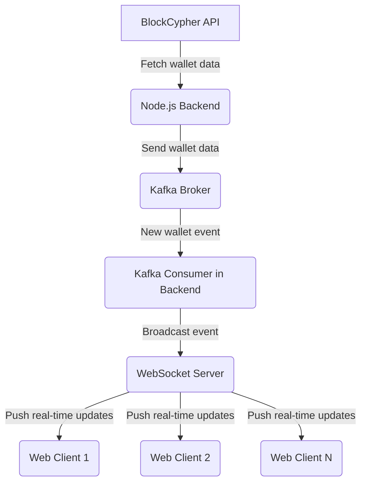

# Real-time Bitcoin Wallet Tracker

This project is a real-time Bitcoin wallet tracker. It fetches wallet data from the BlockCypher API, processes it through a Kafka pipeline, and pushes real-time updates to connected web clients using WebSockets.

## Tech Stack

-   Node.js
-   TypeScript
-   Docker
-   Kafka
-   WebSockets

## Data Flow



## Getting Started

Follow these instructions to get the project set up and running on your local machine.

### Requirements

Make sure you have the following installed:

-   [Node.js](https://nodejs.org/)
-   [Docker](https://www.docker.com/products/docker-desktop)
-   [Docker Compose](https://docs.docker.com/compose/install/)

### Setup

1.  Clone the repository and navigate to the server directory.

2.  Install NPM packages:

    ```sh
    npm install
    ```

3.  Start the Kafka broker and other services using Docker Compose. This will start Kafka and Zookeeper.

    ```sh
    docker-compose up --build
    ```

4.  In a new terminal, run the application:
    ```sh
    npx ts-node src/index.ts
    ```

## Video Demonstration

Here is a video demonstrating the project in action:


**Note:** For the video to display, you'll need to make sure the `bitcoinWalltTrackerVideo.mov` file is in the root of the project directory. GitHub doesn't directly embed `.mov` files in READMEs. You might need to convert it to a GIF or upload it to a video service and link to it.
